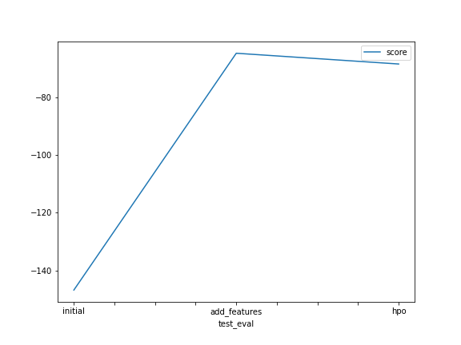
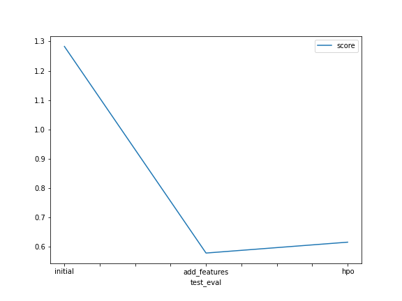

# Report: Predict Bike Sharing Demand with AutoGluon Solution
#### Nate George

## Initial Training
### What did you realize when you tried to submit your predictions? What changes were needed to the output of the predictor to submit your results?
Some of the predictions were negative, so we needed to clip them to 0.

### What was the top ranked model that performed?
The best model was a weighted ensemble L2 using default  hyperparameters.

## Exploratory data analysis and feature creation
### What did the exploratory analysis find and how did you add additional features?
EDA showed close to normal distributions for temperature and humidity, but windspeed and ridership were more like Poisson distributions. We added a new feature for the hour of day.

### How much better did your model preform after adding additional features and why do you think that is?
It performed much better, reducing the RMSLE from 1.28 to 0.58 on the submission test set.

## Hyper parameter tuning
### How much better did your model preform after trying different hyper parameters?
Trying some different hyperparameters decreased performance a bit. With extensive tuning we might be able to do better.

### If you were given more time with this dataset, where do you think you would spend more time?
Probably working more on feature engineering.

### Create a table with the models you ran, the hyperparameters modified, and the kaggle score.
|model|hpo1|hpo2|hpo3|score|
|--|--|--|--|--|
|initial|default|default|default|1.28|
|add_features|default|default|default|0.58|
|hpo|GBM max depth 8|RF max depth 14|default|0.62|

### Create a line plot showing the top model score for the three (or more) training runs during the project.

### Create a line plot showing the top kaggle score for the three (or more) prediction submissions during the project.

## Summary
It looks like adding the hour feature and using default hyperparameters from autogluon worked best.
